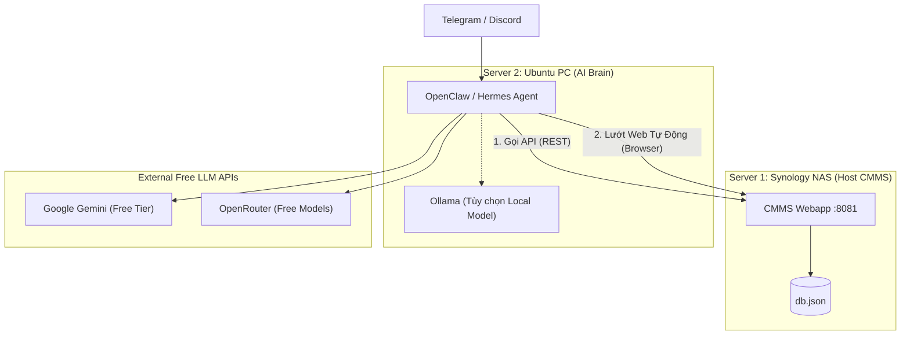

# 🤖 Kiến trúc & Triển khai AI Agent (OpenClaw / Hermes) cho CMMS

Tài liệu này hướng dẫn cách thiết lập một AI Agent (Trợ lý AI độc lập) để giám sát và tương tác với hệ thống CMMS. 

Thay vì cài đặt trên NAS (bị giới hạn RAM), chúng ta sẽ cài đặt AI Agent trên một máy **Ubuntu riêng biệt** để tối đa hóa sức mạnh xử lý (bao gồm lướt web, đọc file lớn), sử dụng các API Model Miễn Phí (Gemini / OpenRouter) hoặc Local Model (Ollama).

---

## 1. Kiến Trúc Hệ Thống (Phân Tán / Multi-Node)



---

## 2. Lựa chọn LLM Model (Không cần trả phí)

Vì bạn không sử dụng Copilot Proxy hay các API key trả phí (OpenAI/Anthropic), đây là 3 lựa chọn tốt nhất cho OpenClaw/Hermes:

1. **Google Gemini (Khuyên dùng)**
   - **Ưu điểm:** Miễn phí (lên đến 15 request/phút), context window siêu lớn (đọc được hàng chục file log cùng lúc), tốc độ rất nhanh.
   - **Cách lấy:** Vào [Google AI Studio](https://aistudio.google.com/) tạo API Key. Model khuyên dùng: `gemini-2.5-flash` hoặc `gemini-2.0-pro-exp`.

2. **OpenRouter (Free Tier)**
   - **Ưu điểm:** Cung cấp API tương thích với chuẩn OpenAI. Có sẵn nhiều model miễn phí chất lượng (như Meta Llama 3 8B, Google Gemma).
   - **Cách lấy:** Vào [OpenRouter](https://openrouter.ai/), đăng nhập và lấy API Key.

3. **Ollama (Local Model - Miễn phí 100%)**
   - **Điều kiện:** Máy Ubuntu cần cấu hình khá (RAM 16GB+, ưu tiên có GPU rời).
   - **Cách dùng:** Cài đặt Ollama trên máy Ubuntu, chạy lệnh `ollama run llama3`.

---

## 3. Cài đặt OpenClaw trên Máy Ubuntu

### Bước 1: Chuẩn bị máy Ubuntu
Cập nhật hệ thống và cài đặt Docker / Docker Compose:
```bash
sudo apt update && sudo apt upgrade -y
sudo apt install -y docker.io docker-compose-v2 git curl
sudo systemctl enable docker && sudo systemctl start docker
```

### Bước 2: Thiết lập OpenClaw Docker
Tạo thư mục trên máy Ubuntu:
```bash
mkdir -p ~/cmms-ai-agent && cd ~/cmms-ai-agent
```

Tạo file `docker-compose.yml`:
```yaml
version: "3.9"

services:
  openclaw:
    image: ghcr.io/openclaw/openclaw:latest
    container_name: openclaw-agent
    restart: unless-stopped
    ports:
      - "18789:18789"
    environment:
      # SỬ DỤNG GEMINI MIỄN PHÍ
      - OPENCLAW_AI_PROVIDER=google
      - OPENCLAW_AI_API_KEY=AIzaSy_YOUR_GEMINI_API_KEY_HERE
      - OPENCLAW_AI_MODEL=gemini-2.5-flash
      
      # HOẶC SỬ DỤNG OPENROUTER (Xóa comment nếu dùng)
      # - OPENCLAW_AI_PROVIDER=openai
      # - OPENCLAW_AI_BASE_URL=https://openrouter.ai/api/v1
      # - OPENCLAW_AI_API_KEY=sk-or-v1-YOUR_OPENROUTER_KEY
      # - OPENCLAW_AI_MODEL=meta-llama/llama-3-8b-instruct:free

      # Cung cấp đường dẫn tới CMMS để AI biết
      - CMMS_URL=http://<IP_CỦA_NAS>:8081
    volumes:
      - ./openclaw-data:/root/.openclaw
```

Khởi động hệ thống:
```bash
docker compose up -d
```

---

## 4. Cách AI Giao tiếp với CMMS

Khi OpenClaw đã chạy trên Ubuntu, nó là một "Người dùng" độc lập. Có 2 cách để nó tương tác:

### Cách 1: Browser Automation (Trình duyệt tự động)
OpenClaw có module điều khiển trình duyệt. Bạn có thể nhắn tin qua Telegram:
> *"Ema, hãy vào trang CMMS `http://<IP_CỦA_NAS>:8081/login`, dùng tài khoản `admin` để đăng nhập. Sau đó lướt xem có Work Order nào mới chưa xử lý không, chụp ảnh màn hình gửi lại cho tôi."*

### Cách 2: Gọi API (Khuyến nghị để theo dõi tự động)
Trong CMMS, bạn tạo sẵn các API để đọc/ghi dữ liệu. Bạn yêu cầu OpenClaw tạo một "Skill" để gọi API định kỳ.
> *"Ema, tạo một skill tên là `monitor-cmms`. Mỗi 30 phút, hãy gửi request GET tới `http://<IP_CỦA_NAS>:3090/api/work-orders`. Nếu phát hiện có Order nào ưu tiên 'Emergency', lập tức nhắn tin báo động cho tôi trên Telegram."*

---

## 5. Kết luận

Với kiến trúc này:
- **NAS (Server 1):** Giảm tải hoàn toàn, chỉ chạy Webapp CMMS cực kỳ mượt mà.
- **Ubuntu (Server 2):** Đóng vai trò máy trạm AI. Chạy OpenClaw, hỗ trợ tự động hóa trình duyệt, phân tích dữ liệu lớn.
- **Chi Phí AI:** 0đ (Sử dụng API miễn phí từ Gemini hoặc OpenRouter).
